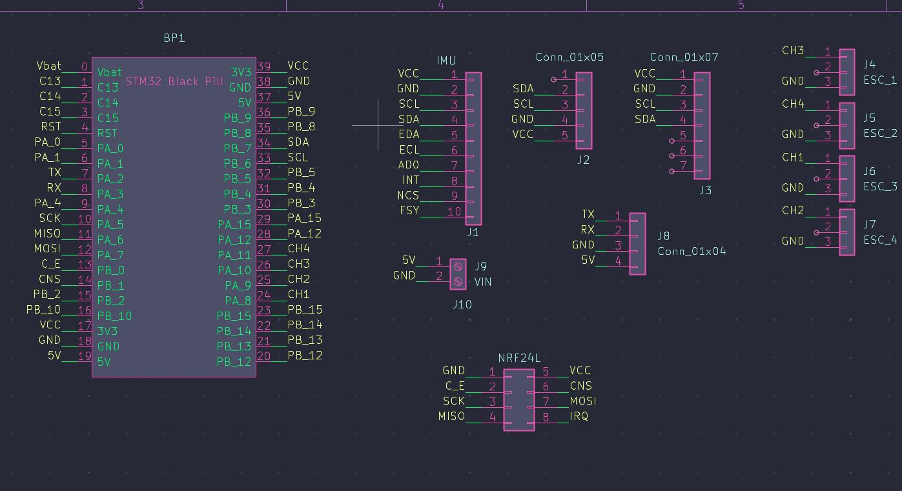
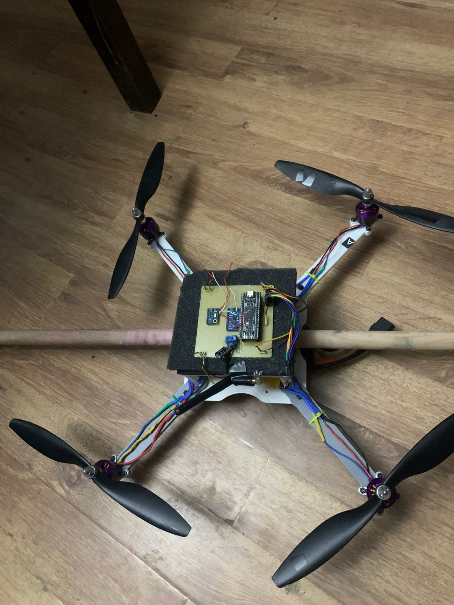

# Horus Link 
**Sistema de Control de Vuelo en Cascada (Angle + Rate) | STM32 + Raspberry Pi 5**

Este proyecto documenta el desarrollo integral de un cuadricóptero estabilizado mediante una arquitectura de control distribuido. El sistema delega el procesamiento crítico de tiempo real a una **STM32F411** y la gestión de telemetría y sintonización a una **Raspberry Pi 5**.

---

## Arquitectura del Sistema

### Hardware Principal
- **Vuelo (FC):** STM32F411CEU6 (Blackpill) - PWM @ 200Hz.
- **Procesamiento de Datos:** Raspberry Pi 5.
- **Sensor (IMU):** MPU9250 (Giroscopio y Acelerómetro).
- **Comunicación:** Módulos NRF24L01+ con protocolo de baja latencia.

### Diseño de Hardware (PCB)
Se diseñó una placa personalizada para integrar los módulos, minimizar el ruido eléctrico y optimizar la distribución de masa.

| Esquema del Circuito | Vista del Dron|
| :---: | :---: |
|  |  |

---

## Control en Cascada (PID)

El dron utiliza una estructura de control jerárquica para lograr un vuelo estable en "Angle Mode":

1. **Lazo Externo (Ángulo):** Procesa la inclinación actual vs. el setpoint deseado. Su salida es la velocidad angular requerida.
2. **Lazo Interno (Rate):** El "obrero" que ajusta los motores a 200Hz para alcanzar la velocidad dictada por el lazo externo, compensando perturbaciones externas de forma inmediata.

---

## Componentes de Software

### 1. Firmware STM32 (C/HAL)
Ubicado en la carpeta `/firmware`. 
- **Filtro Complementario:** Fusión de sensores robusta ($0.98 \times \text{Gyro} + 0.02 \times \text{Accel}$).
- **Motor Mixer:** Algoritmo de mezcla en X para el eje de Roll.
- **Failsafe:** Protocolo de seguridad que desarma los motores tras 15s de pérdida de enlace.

### 2. Estación de Tierra (Python)
Ubicado en la carpeta `/gcs`.
- **Live Tuning:** Ajuste de $K_p, K_i, K_d$ desde la consola sin aterrizar.
- **Telemetría:** Graficación en tiempo real con Matplotlib y exportación a CSV para análisis.

---

## Demostración y Pruebas

[

---

## Instrucciones de Uso

1. **Conexión:** Enciende el dron y verifica el LED del NRF24.
2. **GCS:** Ejecuta `python main_gcs.py` en la Raspberry Pi.
3. **Calibración:** Envía el comando `cal` manteniendo el dron nivelado.
4. **Armado:** Una vez calibrado, usa `arm` y sube el throttle gradualmente con `thr 1300`.

---
